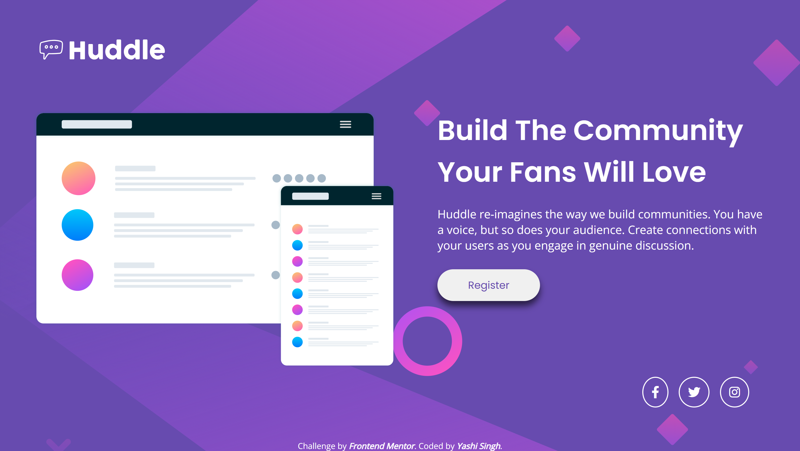
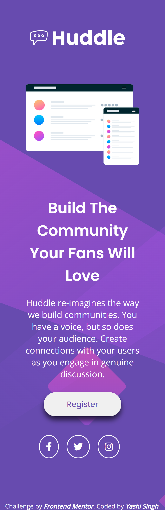

# Frontend Mentor - Huddle Landing Page with a Single Introductory Section Solution

This is a solution to the [Huddle landing page with single introductory section challenge on Frontend Mentor](https://www.frontendmentor.io/challenges/huddle-landing-page-with-a-single-introductory-section-B_2Wvxgi0). Frontend Mentor challenges help you improve your coding skills by building realistic projects.

## Table of Contents

- [Overview](#overview)
  - [The Challenge](#the-challenge)
  - [Screenshot](#screenshot)
  - [Links](#links)
- [My Process](#my-process)
  - [Built With](#built-with)
  - [Installation and Running LESS](#installation-and-running-less)
  - [What I Learned](#what-i-learned)
  - [Continued Development](#continued-development)
  - [Useful Resources](#useful-resources)
- [Author](#author)
- [Acknowledgments](#acknowledgments)

## Overview

### The Challenge

Users should be able to:

- View the optimal layout for the page depending on their device's screen size.
- See hover states for all interactive elements on the page.

### Screenshot

**Desktop Design**


**Mobile Design**


### Links

- Solution URL: [Solution URL](https://www.frontendmentor.io/solutions/huddle-landing-page-with-a-single-introductory-section-I5xNj6LLYw)
- Live Site URL: [Live Demo](https://yashi-singh-9.github.io/Huddle-Landing-Page-With-a-Single-Introductory-Section/)

## My Process

### Built With

- Semantic HTML5 markup
- LESS Preprocessor for CSS
- CSS Flexbox
- Responsive Design (Mobile-first workflow)
- Google Fonts
- Font Awesome Icons

### Installation and Running LESS

To install and run the LESS preprocessor, follow these steps:

1. Install Node.js if you haven't already. You can download it from [Node.js official website](https://nodejs.org/).
2. Install LESS globally using npm:
   ```sh
   npm install -g less
   ```
3. To compile your LESS files into CSS, run the following command in your project directory:
   ```sh
   lessc styles/style.less styles/style.css
   ```
4. Use a task runner like Gulp or configure a watch command to automatically compile LESS when changes are made.

### What I Learned

During this challenge, I strengthened my skills in using the LESS preprocessor to manage styling efficiently. I also improved my understanding of responsive design and the importance of using media queries for mobile-first development.

Some key learnings include:

- Implementing hover effects for better user interaction:

```css
button:hover {
  background-color: @soft-magenta;
  color: @white;
}
```

- Using media queries to adjust layout for different screen sizes:

```css
@media (max-width: 768px) {
  background: url(images/bg-mobile.svg) no-repeat @violet;
}
```

### Continued Development

In future projects, I want to:

- Explore more CSS preprocessors like SASS for better project scalability.
- Improve accessibility practices for better user experience.
- Enhance animations and transitions for a smoother interface.

### Useful Resources

- [LESS Documentation](http://lesscss.org/) - Helped me understand how to structure my styles efficiently.
- [CSS Tricks - Flexbox Guide](https://css-tricks.com/snippets/css/a-guide-to-flexbox/) - Helped with structuring my layout.
- [Google Fonts](https://fonts.google.com/) - For typography styling.

## Author

- LinkedIn - [Yashi Singh](https://www.linkedin.com/in/yashi-singh-b4143a246)
- Frontend Mentor - [Yashi-Singh-9](https://www.frontendmentor.io/profile/Yashi-Singh-9)

## Acknowledgments

Thanks to Frontend Mentor for providing these great challenges! They are incredibly useful for sharpening frontend development skills.
